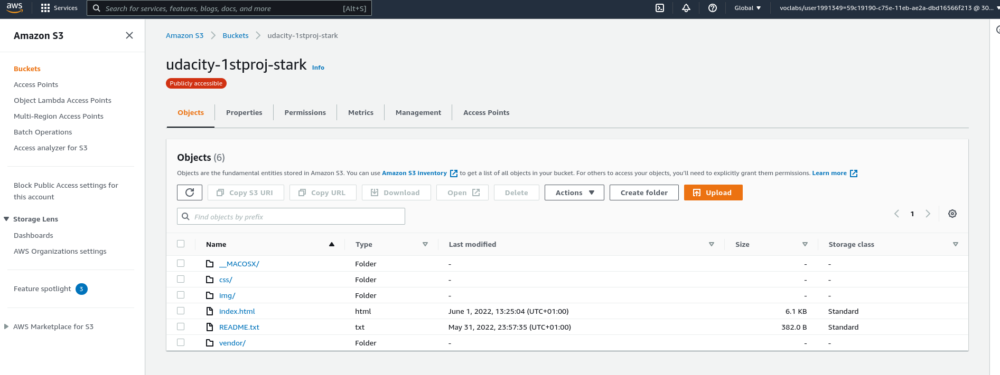
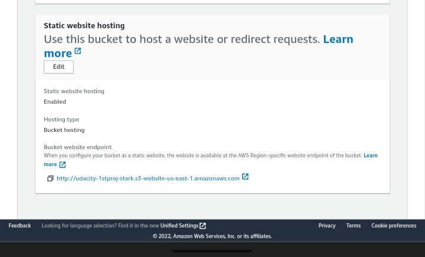
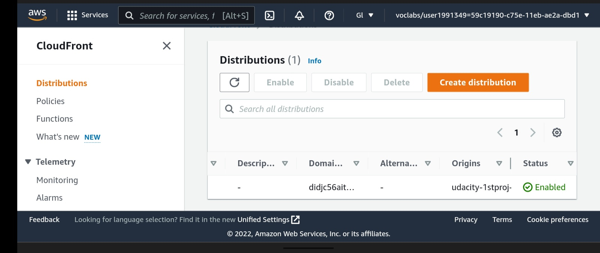

# cloudfront-s3-static-site

An AWS project where I deploy a static site to AWS S3 and distribute it securely using AWS cloudfront🥇. In this project I uploaded the html, css and required image files to an S3 bucket I created on AWS, and made the bucket publicly available for static site hosting. I used the CloudFront CDN to distibute the site securely.

### Adding files to S3 bucket

### Setup for site hosting

### CloudFront Distribution

### Final output -

Check it out here 😊

- [CloudFront Url](https://didjc56aitl6x.cloudfront.net)

- [Direct S3 website link](http://udacity-1stproj-stark.s3-website-us-east-1.amazonaws.com)

